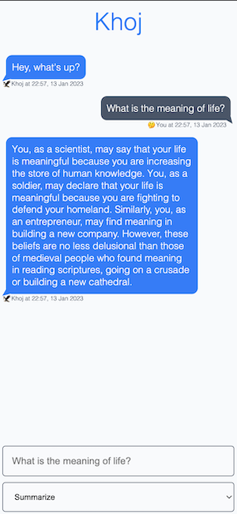

### Ridge Chat
#### Overview
- Creates a personal assistant for you to inquire and engage with your notes
- Uses [ChatGPT](https://openai.com/blog/chatgpt) and [Ridge search](/#/search). [Offline chat](https://github.com/ridge-ai/ridge/issues/201) is coming soon.
- Supports multi-turn conversations with the relevant notes for context
- Shows reference notes used to generate a response

!> **Warning**: This will enable Ridge to send your query and note(s) to OpenAI for processing

#### Setup
- Get your [OpenAI API Key](https://platform.openai.com/account/api-keys)
- Add your OpenAI API to Ridge by using either of the two options below:

  - Open your [Ridge settings](http://localhost:42110/config/processor/conversation), add your OpenAI API key, and click *Save*. Then go to your [Ridge settings](http://localhost:42110/config) and click `Configure`. This will refresh Ridge with your OpenAI API key.

  - Set `openai-api-key` field under `processor.conversation` section in your `ridge.yml` @ `~/.ridge/ridge.yml` to your [OpenAI API key](https://beta.openai.com/account/api-keys) and restart ridge:
    ```diff
    processor:
      conversation:
    -    openai-api-key: # "YOUR_OPENAI_API_KEY"
    +    openai-api-key: sk-aaaaaaaaaaaaaaaaaaaaaaaahhhhhhhhhhhhhhhhhhhhhhhh
        model: "text-davinci-003"
        conversation-logfile: "~/.ridge/processor/conversation/conversation_logs.json"
    ```

#### Use
1. Open [/chat](http://localhost:42110/chat)
2. Type your queries and see response by Ridge from your notes

#### Demo


### Details
1. Your query is used to retrieve the most relevant notes, if any, using Ridge search
2. These notes, the last few messages and associated metadata is passed to ChatGPT along with your query for a response
